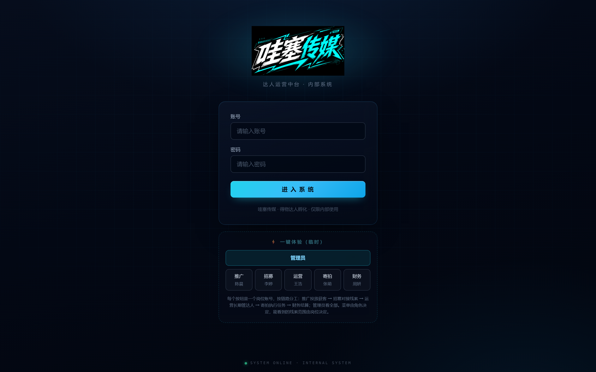
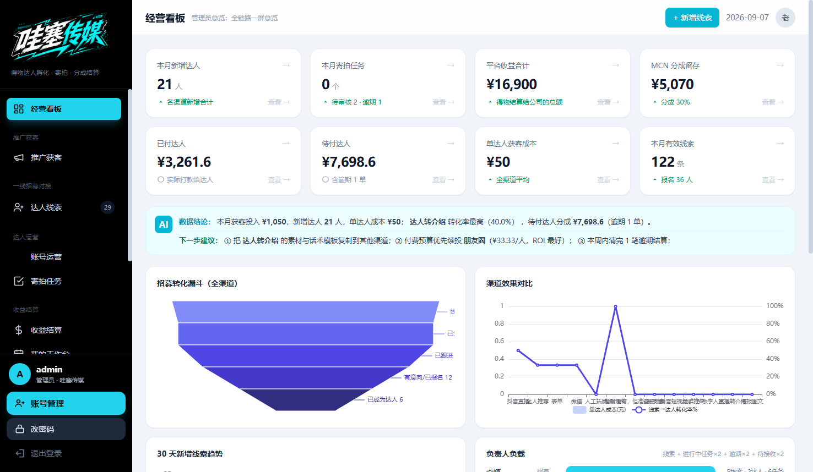
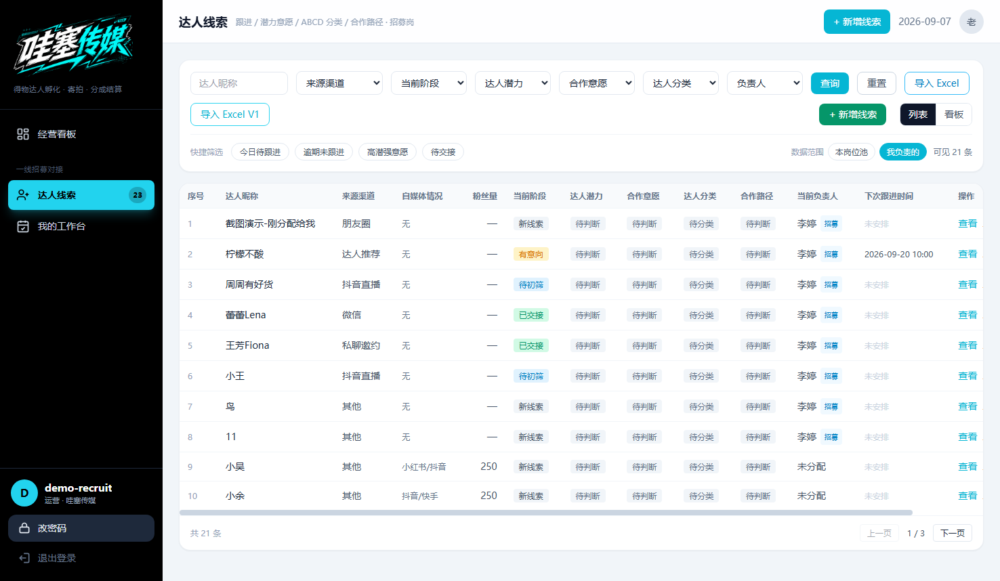
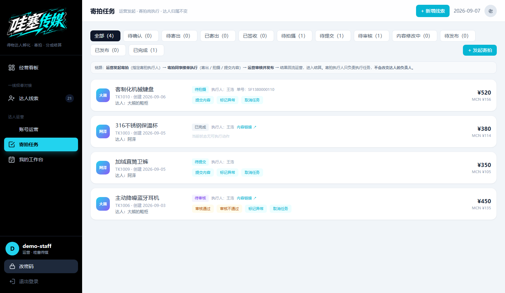
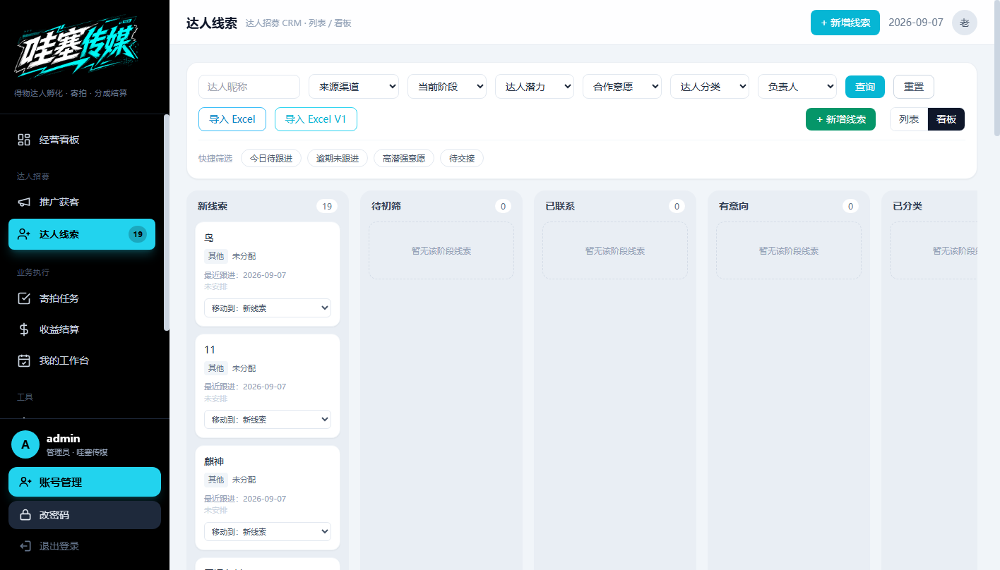
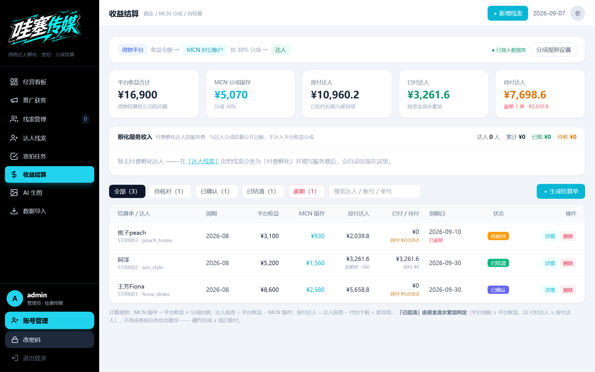

# 得物 MCN 达人增长运营系统

面向真实 MCN 公司达人管理业务的数字化管理后台：将分散在微信、Excel 中的达人招募、跟进与交接流程，沉淀为统一的线上系统。

> 覆盖完整业务链路：**达人获客 → 线索管理 → 达人陪跑 → 运营管理 → 任务协作 → 数据分析**

## 在线演示

- 地址：`http://120.25.151.128:3000`
- 登录页内置**一键体验按钮**，可分别以管理员 / 推广 / 招募 / 普通运营 / 高级运营 / 财务六种身份进入系统，直观感受 role + position 双层权限下的数据隔离与页面差异。

## 界面预览

| 登录页 | 管理员经营看板 |
| --- | --- |
|  |  |

| 达人线索管理 | 运营任务 |
| --- | --- |
|  |  |

| 岗位看板 | 财务结算 |
| --- | --- |
|  |  |

## 核心功能

- **达人线索 CRM**：来源渠道、联系信息、跟进状态、SLA 首次联系时限、负责人分配
- **达人档案与生命周期**：线索 → 陪跑 → 重点培养 → 签约 → 公司直属，全状态流转
- **权限模型**：role + position 双层模型，六类岗位（管理员/推广/招募/运营/高级运营/财务）数据访问隔离，服务端强校验
- **任务中心**：内容任务 / 拍摄寄拍 / 成长任务，任务归属运营负责人，支持分配、催办与审核
- **经营看板**：达人增长、渠道 ROI、运营效率、收益数据
- **移动端适配**：响应式布局，手机端卡片流操作

## 技术架构

- **前端**：Vue3（CDN 引入）+ JavaScript + HTML/CSS + Tailwind
- **后端**：Node.js 单文件服务（零 npm 依赖），RESTful API
- **数据**：JSON 文件数据库（预留 MySQL 升级路径）
- **开发**：Git/GitHub 版本管理，AI Coding 辅助开发（规范文档约束修改范围 + 生成代码人工验证）
- **部署**：Linux 云服务器 + systemd，零依赖快速上线

## 快速开始

```bash
# 零依赖，无需 npm install
node v1/server.js
# 默认 http://127.0.0.1:3000
```

## 回归测试

内置 500+ 项零依赖自动化回归（API 层 / 权限矩阵 / 业务主链 / SLA / UI 层），覆盖分岗位数据隔离、越权访问 403、生命周期转化不变量等关键行为。

## 许可

仅供学习与演示使用。
